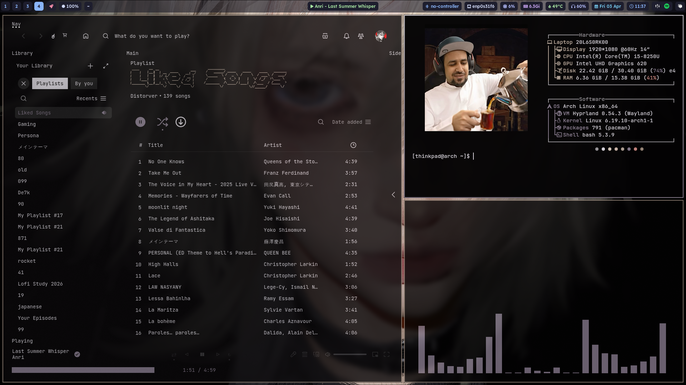
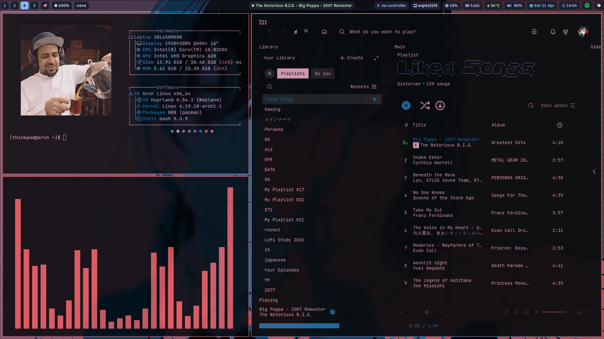
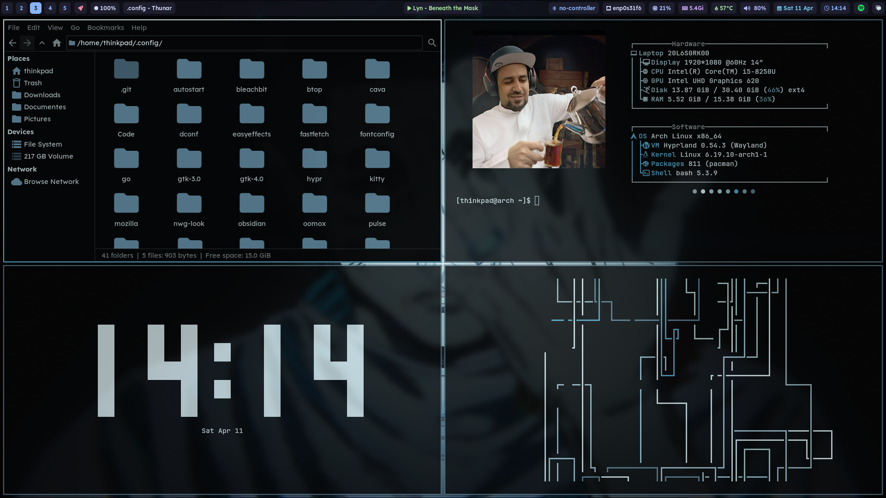
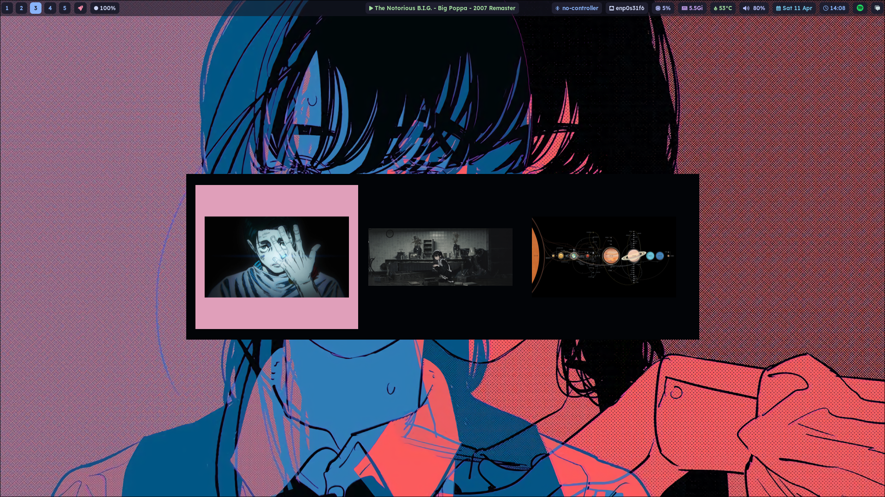
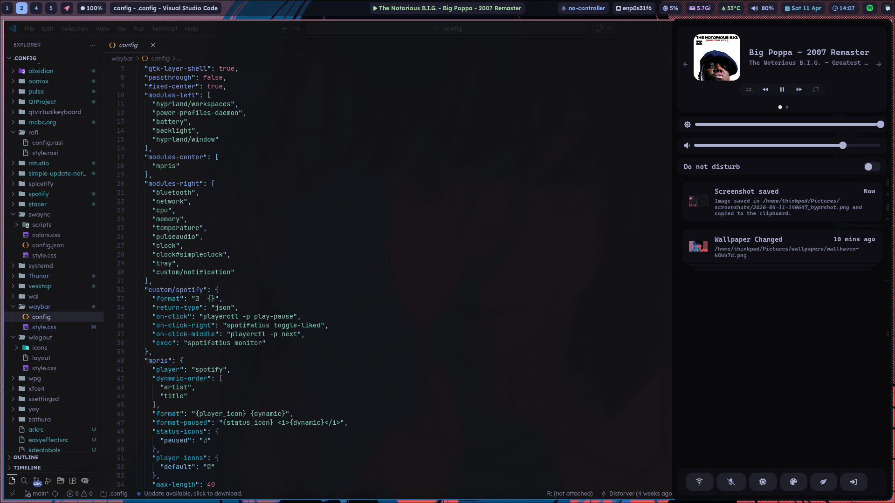

# 🌌 Hyprland: [First rice]

A personal exploration of the Hyprland compositor. This repository serves as a visual archive of my current Arch Linux desktop environment, focusing on deep dark tones and a unified Wayland workflow.

---

## 🖼️ Gallery

### Desktop Overview

  
  

### The Workspace & Workflow

*Featuring customized window gaps and border gradients.*

### Application Launcher & Notifications

  
  

---

## 💻 Tech Stack & Customization

This setup is built on **Arch Linux** and optimized for a **ThinkPad** workflow.

| Layer | Component |
| :--- | :--- |
| **Compositor** | Hyprland |
| **Status Bar** | Waybar |
| **Notifications** | SwayNC |
| **Launcher** | Rofi |
| **Colors** | Generated via Pywal |
| **Terminal** | Kitty |

---
